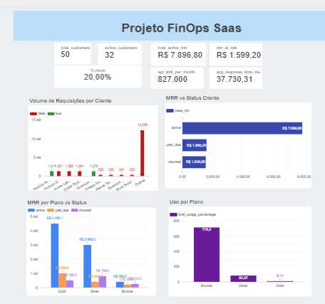

# 📈 SaaS FinOps Data Pipeline: Da Ingestão ao Business Intelligence

## 📖 Sobre o Projeto
Este projeto implementa um pipeline de dados *end-to-end* baseado nos princípios modernos de **FinOps (Financial Operations)** para uma plataforma SaaS de alta escala. 

O grande desafio de negócio resolvido aqui é o cruzamento de **dados relacionais contratuais** (armazenados em um banco transacional Postgres) com **logs semiestruturados volumosos** de utilização de API (armazenados em JSON no Cloud Storage). Através desse ecossistema, a empresa consegue monitorar a saúde financeira em tempo real, rastreando a taxa de inadimplência ativa (*Past Due*), calculando a taxa de cancelamento (*Churn*) e projetando receitas adicionais através de taxas de *overage* (clientes que abusaram do teto operacional dos seus planos).

---

## 🏗️ Arquitetura e Tech Stack

A arquitetura foi desenhada seguindo as melhores práticas da **Modern Data Stack (MDS)** e os conceitos da **Arquitetura Medalhão**:

* **Banco Transacional (Origem):** PostgreSQL hospedado no Google Cloud SQL.
* **Ingestão & Orquestração:** Script Python (idempotente) aplicando particionamento em estilo *Hive* por Ano/Mês/Dia.
* **Data Lake (Bronze):** Google Cloud Storage (GCS) atuando como repositório de arquivos brutos (CSV e JSON).
* **Data Warehouse:** Google BigQuery processando queries em alta performance.
* **Analytics Engineering (Silver/Gold):** **dbt-core (Data Build Tool)** gerenciando dependências, linhagem e transformações.
* **Data Quality (Testes):** dbt Data Tests nativos garantindo integridade referencial, limites de valores e chaves únicas.
* **Visualização (BI):** Google Looker Studio para o Sumário Executivo e painel operacional.

---

## 🗂️ Estrutura do Repositório

```text
saas_finops_pipeline/
├── credentials/                 # [IGNORADO NO GIT] Chave privada gcp-key.json
├── logs/                        # [IGNORADO NO GIT] Logs globais de execução
├── src/
│   ├── ingestion/
│   │   ├── generate_mock_data.py # Geração dinâmica de 50 clientes e 15k logs (Python)
│   │   └── extract_to_gcs.py     # Carga automatizada e particionada para o Storage
│   └── transformation/
│       └── saas_analytics/       # Projeto dbt Core
│           ├── macros/           # Regra de sobrescrita de schema (generate_schema_name.sql)
│           ├── models/
│           │   ├── staging/      # Camada Silver: Esquemas, fontes e castings limpos
│           │   └── marts/        # Camada Gold: Tabelas Fato, Dimensões e Views de BI
│           └── dbt_project.yml   # Arquivo central de configuração do dbt
├── tmp/                         # [IGNORADO NO GIT] Arquivos de massa de dados locais
├── .env                         # [IGNORADO NO GIT] Variáveis de ambiente e senhas
├── .gitignore                   # Regras rígidas de exclusão e segurança do Git
└── screenshot_projeto_saas.png  # Captura de tela do Dashboard analítico
```

---

## 🛢️ Fluxo de Modelagem (dbt Lineage DAG)

O dbt orquestrou a transformação dividindo os dados estritamente em camadas de governança e isolamento:

* **Staging (`saas_silver`):** `stg_saas_customers`, `stg_saas_plans` e `stg_saas_usage_logs`. Realiza a limpeza de strings (`TRIM`), tratamento de timestamps ISO e padronização de tipos de dados de forma explícita.
* **Core / Fatos (`saas_silver`):** `fct_finops_api_health`. Consolidação atômica e física cruzando o consumo real de requisições agregadas de cada empresa contra as amarras do plano contratado no Postgres.
* **Marts / BI (`saas_gold`):** * `mart_finops_executive_summary`: Tabela estática otimizada para o C-Level contendo métricas consolidadas de MRR, Churn e Receita Potencial.
  * `mart_finops_api_health_detail`: View virtual protegida atuando como camada de abstração para ferramentas de BI detalharem o consumo analítico por cliente sem duplicar custos de armazenamento.

---

## 📊 Regras de Negócio Implementadas

* **Cálculo de Churn Rate:** Percentual de clientes com status `churned` sobre a base total histórica de clientes cadastrados.
* **Percentual em Débito (`past_due_percentage`):** Proporção de clientes ativos na plataforma que encontram-se com pendências ou atrasos financeiros em suas assinaturas.
* **MRR em Risco (Past Due):** Soma da receita recorrente mensal (MRR) proveniente de contas operacionais com pendências financeiras em aberto.
* **Taxa de Overage FinOps:** Identificação automatizada de quebra de teto da API (`has_exceeded_limit = TRUE`). O pipeline projeta uma receita incremental aplicando uma taxa/multa de **20% sobre o preço base do plano** do cliente infrator.

---

## 🚀 Como Executar o Pipeline Localmente

### 1. Pré-requisitos e Ambiente
Instale as dependências contidas no ambiente virtual:
```bash
python -m venv venv
./venv/Scripts/activate # Windows
pip install -r requirements.txt
```

### 2. Geração e Extração de Dados
Certifique-se de configurar o arquivo `.env` com as credenciais do seu banco e execute a esteira de dados sintéticos:
```bash
python src/ingestion/generate_mock_data.py
python src/ingestion/extract_to_gcs.py
```

### 3. Execução e Validação com o dbt
Navegue até a pasta do dbt, verifique a conexão com a nuvem e execute o build completo (modelagem + testes de qualidade):
```bash
cd src/transformation/saas_analytics
dbt debug
dbt run
dbt test
```

---

## 📐 Camada de Visualização (Looker Studio)

O resultado final das tabelas materializadas na camada de entrega **Gold** (`saas_gold`) foi conectado diretamente ao Looker Studio para consumo executivo e tomada de decisão estratégica.



> 💡 **Principais Insights do Dashboard:** O painel exibe de forma clara a distribuição de clientes e comprova a eficácia das regras do dbt, permitindo ao CFO visualizar instantaneamente a volumetria de clientes ativos, a taxa de churn controlada em 20%, o MRR em risco por inadimplência e o ganho financeiro potencial com a cobrança automatizada de taxas por uso excessivo da API.
